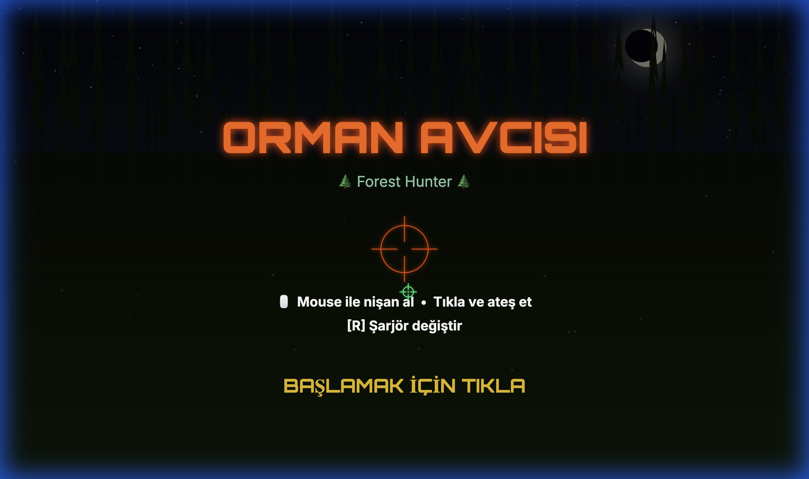
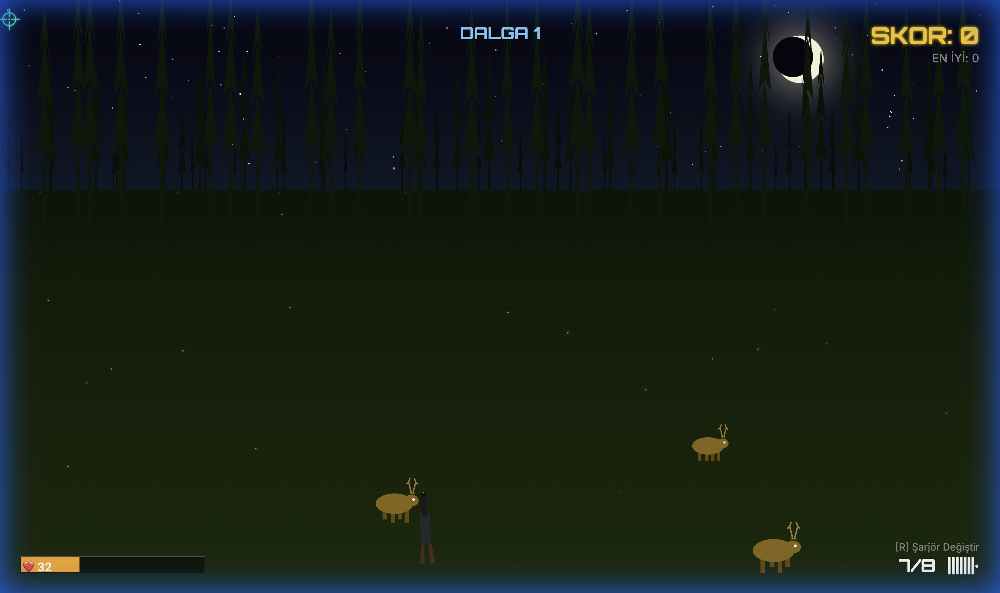
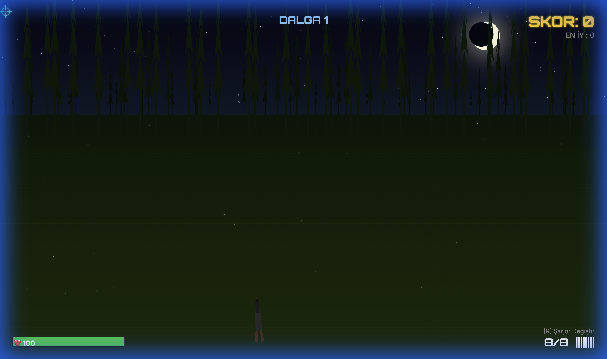

# 🌲 Forest Hunter (Orman Avcısı)

A first-person forest hunting game built with vanilla HTML/CSS/JS + Canvas API. No frameworks, no dependencies.

Animals charge towards you from the dark forest — aim with your mouse and shoot them before they reach you!

## Screenshots

### Menu Screen


### Gameplay — Animals Approaching


### Gameplay — Gun and HUD


## Features

- 🌙 **Atmospheric night forest** — moon, stars, layered tree silhouettes, fireflies, fog
- 🦌 **4 animal types** — Deer, Wolf, Boar, Bear (each with different speed/health/points)
- 🔫 **Shooting mechanics** — muzzle flash, recoil, screen shake, ammo counter
- 💥 **Particle effects** — hit splashes, death explosions, muzzle flash sparks
- 🌊 **Wave system** — increasing difficulty with each wave
- 🎵 **Procedural audio** — gunshot, hit, death, and reload sounds via Web Audio API
- 🏆 **Score + combo system** — chain kills for score multipliers
- 🎯 **Pseudo-3D perspective** — animals spawn far away and grow as they approach

## Animal Types

| Type | Speed | Health | Points | Behavior |
|------|-------|--------|--------|----------|
| 🦌 Deer | Slow | 1 | 100 | Runs straight |
| 🐺 Wolf | Fast | 1 | 150 | Zigzags |
| 🐗 Boar | Medium | 2 | 200 | Charges straight |
| 🐻 Bear | Slow | 3 | 300 | Large, tanky |

## Controls

| Input | Action |
|-------|--------|
| 🖱️ Mouse | Aim crosshair |
| 🖱️ Left Click | Shoot |
| ⌨️ R | Reload |

## How to Run

```bash
# Clone or download the project, then:
cd forest-hunter
npx serve .

# Open http://localhost:3000 in your browser
```

Or simply open `index.html` directly in your browser.

## Tech Stack

- **HTML5 Canvas** — all rendering
- **Vanilla JavaScript** — game engine, physics, AI
- **Web Audio API** — procedural sound effects
- **CSS** — minimal (fullscreen canvas, hidden cursor)

## License

MIT
